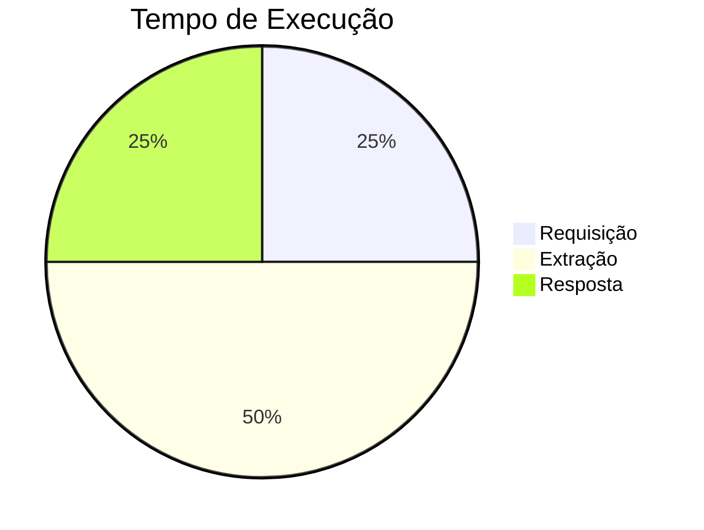

# API Correios
A API dos Correios permite consultar o endereço correspondente a um determinado CEP.

### Documentação

Para consultar o endereço basta informar o **cep**.

### Requisitos
A API dos correios **não** necessita resolver captcha.

---

#### Método
**`POST`**

#### URL
`{url_lambda}/consulta_cep`

---

#### Corpo da Requisição
```json
{
    "cep": 20231030
}
```

- Aceita CEPs nos formatos `20231-030` (como string) ou `20231030` (como inteiro).


#### Header da Requisição
```json
{
    "Content-Type": "application/json",
    "Authorization": "Bearer {token}"
}
```
    
---


#### Corpo da Resposta
Codigo de retorno: 200

**Resposta:**
```json 
{
    "logradouro": "Avenida Henrique Valadares",
    "bairro": "Centro",
    "cep": "20231-030",
    "municipio": "Rio de Janeiro",
    "estado": "RJ"
}
```
---

Codigo de retorno: 400

**Resposta:**
```json
{
    "message": "Cep inválido"
}
```
Motivo da falha: CEP inválido

---

### Tempo de execução
Nos testes locais, o tempo médio foi de `160 milisegundos`.



### Geração de Token
O token jwt será disponibilizado pela [DigitalPath](https://digitalpath.com.br).

