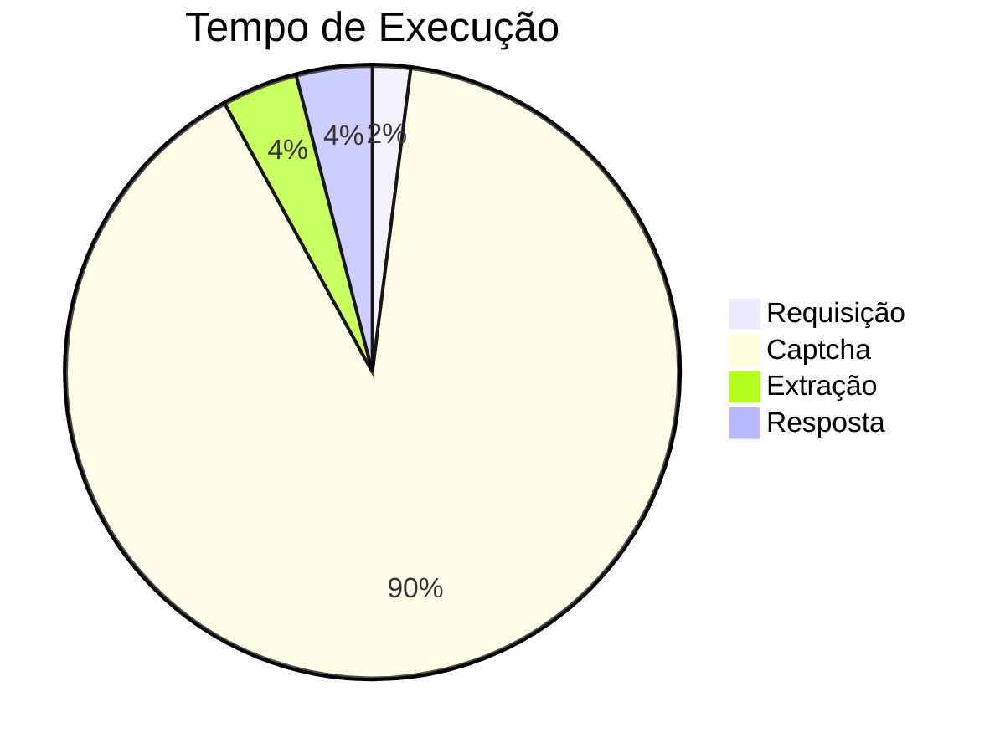

# API Receita

A API da receita busca os dados de uma empresa pelo CNPJ.

### Documentação

Para consultar a empresa basta informar o **cnpj**.

### Requisitos
A API da receita **necessita** resolver captcha.

---

#### Método
**`POST`**

#### URL

`{url_lambda}/consulta_cnpj`

---

#### Corpo da Requisição
```json
{
    "cnpj": "12345678000195"
}
```

- Aceita CNPJs nos formatos `"12.345.678/0001-95"` (como string) ou `12345678000195` (como inteiro).


#### Header da Requisição
```json
{
    "Content-Type": "application/json",
    "Authorization": "Bearer {token}"
}
```
    
---


#### Corpo da Resposta
Codigo de retorno: 200

**Resposta:**
```json 
{
    "cnpj": "12345678000195",
    "tipo_filial": "MATRIZ",
    "data_abertura": "01/01/2000",
    "nome": "EMPRESA EXEMPLO S.A.",
    "nome_fantasia": "EMPRESA EXEMPLO",
    "atividade_principal": "47.00-0-00 - Comércio varejista",
    "atividade_secundaria": "46.00-0-00 - Representantes comerciais",
    "natureza_juridica": "204-6 - Sociedade Anônima Aberta",
    "logradouro": "AV EXEMPLO",
    "numero": "123",
    "complemento": "ANDAR 1",
    "cep": "12345-678",
    "municipio": "CIDADE EXEMPLO",
    "bairro": "CENTRO",
    "uf": "EX",
    "email": "contato@empresaexemplo.com",
    "telefone": "1234-5678",
    "efr": null,
    "situacao_cadastral": "ATIVA",
    "data_situacao_cadastral": "01/01/2000",
    "motivo_situacao_cadastral": null,
    "situacao_especial": null,
    "data_situacao_especial": null
}

```
---

Codigo de retorno: 400

**Resposta:**
```json
{
    "error": "CNPJ inválido"
}
```
Motivo da falha: CNPJ inválido

---

Codigo de retorno: 500

**Resposta:**
```json
{
    "error": "acesso ao site da receita federal negado"
}
```
Motivo da falha: O captcha não pode ser resolvido (refaça a requisição).

---

Codigo de retorno: 500

**Resposta:**
```json
{
    "error": "Erro interno"
}
```
Motivo da falha: Erro interno ao processar a requisição.

### Tempo de execução
Nos testes locais, o tempo médio foi de `15 segundos`.



### Geração de Token
O token jwt será disponibilizado pela [DigitalPath](https://digitalpath.com.br).


