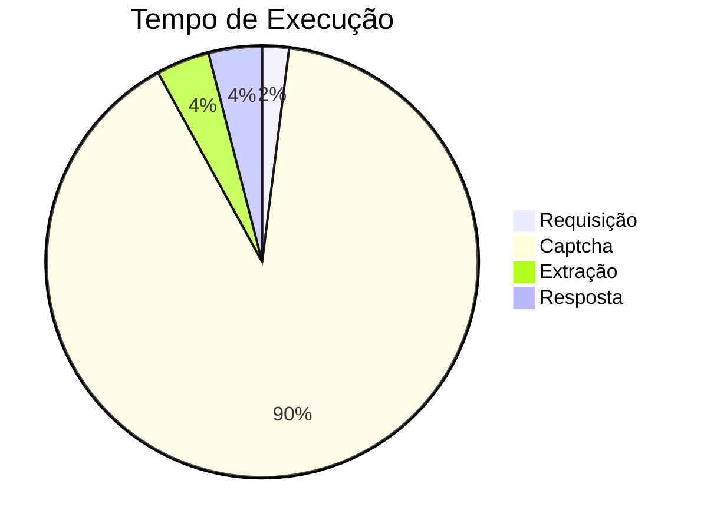

# API Sintegra

A API do SINTEGRA busca os dados de uma empresa pelo CNPJ/CPF OU IE.

### Documentação


Para requisições com **ie**, o **cnpj_cpf** deve ser informado como `null`.

Para requisições com **cnpj_cpf**, o **ie** deve ser informado como `null`.

O Campo **uf** é **obrigatório**. Utilize a sigla do estado.

Caso o **cnpj_cpf** e o **ie** forem informados, o sistema vai priorizar a busca pelo **ie**.

### Requisitos
A API **necessita** resolver captcha.

---

#### Método
**`POST`**

#### URL

`{url_lambda}/consulta_sintegra`

---

#### Corpo da Requisição
```json
{
    "cnpj_cpf": "00.000.000/0000-00", 
    "uf": "SP", 
    "ie": null
}
```

- Aceita CNPJs nos formatos `"12.345.678/0001-95"` (como string) ou `12345678000195` (como inteiro).
> PS: O mesmo vale para CPFs.


#### Header da Requisição
```json
{
    "Content-Type": "application/json",
    "Authorization": "Bearer {token}"
}
```
    
---


#### Corpo da Resposta
Codigo de retorno: 200

**Resposta:**
```json 
{
    "nome": "EMPRESA GENERICA LTDA.",
    "uf": "XX",
    "cnpj": "00.000.000/0000-00",
    "situacao_cnpj": "Sem restrição",
    "ie": "000000000000",
    "situacao_ie": "Habilitado",
    "tipo_ie": "IE Normal",
    "cnae_principal": "0000000",
    "data_situacao_uf": "01/01/2000",
    "nome_fantasia": null,
    "data_inicio_atividade": "01/01/2000",
    "data_fim_atividade": null,
    "regime_tributacao": "Normal",
    "ie_destinatorio": "Obrigatória",
    "porte": "Não informado",
    "credito_presumido": "Não informado",
    "tipo_produtor": "Não",
    "municipio_ibge": "0000000 - Municipio Generico",
    "logradouro": "RUA GENERICA",
    "numero": "000",
    "complemento": "COMPLEMENTO GENERICO",
    "bairro": "BAIRRO GENERICO",
    "cep": "00000000"
}

```
---

Codigo de retorno: 400

**Resposta:**
```json
{
    "Code": "BadRequestError",
    "Message": "CNPJ inválido"
}
```
Motivo da falha: CNPJ inválido

---
### Tempo de execução
Nos testes locais, o tempo médio foi de `4 segundos`.



### Geração de Token
O token jwt será disponibilizado pela [DigitalPath](https://digitalpath.com.br).


